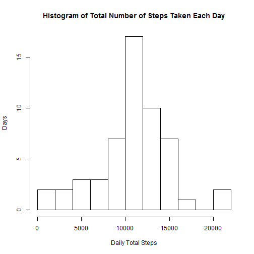
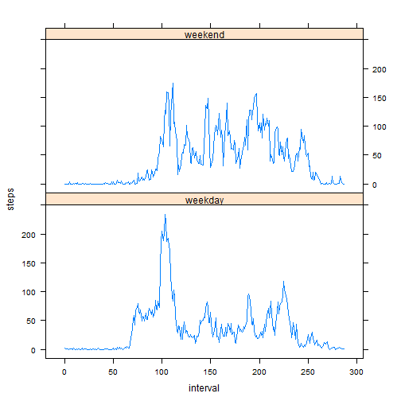

# Reproducible Research: Peer Assessment 1


## Loading and preprocessing the data

```r
Data.Raw <- read.csv(file="activity.csv",
                     colClasses = c("numeric","Date","numeric"),
                     header=TRUE,sep=",")
Data.Raw$interval <- as.integer(lapply(Data.Raw$interval,
                                function(x) (as.integer(x/100)*60 + x%%100)/5))
```


## What is mean total number of steps taken per day?

```r
## ignore the missing values
Data.NoNa <- na.omit(Data.Raw)
## find total number of steps taken each day
library(plyr)
Data.Total <- ddply(Data.NoNa, .(date), summarize, steps = sum(steps))
## make a histogram of the total number of steps taken each day
hist(Data.Total$steps, breaks = 10, 
     main = "Histogram of Total Number of Steps Taken Each Day", 
     xlab = "Daily Total Steps", ylab = "Days")
```

 

```r
## calculate and report the mean and median total number of steps taken per day
Steps.Mean   <- mean(Data.Total$steps,na.rm=TRUE)
print(paste("The mean total number of steps taken per day is: ", Steps.Mean))
```

```
## [1] "The mean total number of steps taken per day is:  10766.1886792453"
```

```r
Steps.Median <- median(Data.Total$steps,na.rm=TRUE)
print(paste("The median total number of steps taken per day is: ", Steps.Median))
```

```
## [1] "The median total number of steps taken per day is:  10765"
```


## What is the average daily activity pattern?

```r
## find daily average number of steps taken
library(plyr)
Data.Average <- ddply(Data.Raw, .(interval), summarize, 
                      steps = mean(steps,na.rm=TRUE))
## make a time series plot of the 5-minute interval and the average number of steps taken (average across all days)
plot(Data.Average$steps ~ Data.Average$interval, type="l",
     main = "Average Number of Steps Across all Days",
     xlab = "Indices of the 5-minute Time Intervals",
     ylab = "Average Number of Steps")
```

 

```r
## locate the 5-minute interval which contains the maximum number of steps
PeakIntervalIndex <- which(Data.Average$steps == max(Data.Average$steps))
print(paste("On the ",PeakIntervalIndex,"-th interval, the variable 'steps' attains its maximum: ", Data.Average$steps[PeakIntervalIndex], sep=""))
```

```
## [1] "On the 104-th interval, the variable 'steps' attains its maximum: 206.169811320755"
```

## Imputing missing values
<strong>1</strong> Calculate and report the total number of missing values in the dataset (i.e. the total number of rows with NA)

```r
NaRow <- dim(Data.Raw) - dim(Data.NoNa)
NaRow <- NaRow[1]
print(paste("The total number of rows with NA) is:",NaRow))
```

[1] "The total number of rows with NA) is: 2304"

<strong>2</strong> Devise a strategy for filling in all of the missing values in the dataset. The strategy does not need to be sophisticated. For example, you could use the mean/median for that day, or the mean for that 5-minute interval, etc.

<strong>Answer:</strong> I choose mean for that 5-minute interval to fill the corresponding missing values.


<strong>3</strong> Create a new dataset that is equal to the original dataset but the missing data filled in

```r
## Fill missing values with mean for the 5-minute interval
Data.Filled <- Data.Raw
n <- dim(Data.Raw)[1]
for(i in 1:n)
{
    if(is.na(Data.Filled$steps[i]))
    {
        x <- Data.Filled$interval[i]
        j <- (as.integer(x/100)*60 + x%%100)/5 + 1
        Data.Filled$steps[i] = as.integer(Data.Average$steps[i])
    }
}
rm(list=c("n","i","j","x"))
```

<strong>4</strong> Make a histogram of the total number of steps each day and calculate and report mean and median total number of steps taken per day. Do these values differ from the estimates from the first part of the assignment? What is the impact of imputing missing data on the estimates of the total daily number of steps?

```r
## find total number of steps taken each day
library(plyr)
Data.Filled.Total <- ddply(Data.Filled, .(date), summarize, steps = sum(steps))
## make a histogram of the total number of steps taken each day
hist(Data.Filled.Total$steps, breaks = 10, 
     main = "Histogram of Total Number of Steps Taken Each Day", 
     xlab = "Daily Total Steps", ylab = "Days")
```

 

```r
## calculate and report the mean and median total number of steps taken per day
Steps.Filled.Mean   <- mean(Data.Filled.Total$steps,na.rm=TRUE)
print(paste("The mean total number of steps taken per day is: ", 
            Steps.Filled.Mean))
```

[1] "The mean total number of steps taken per day is:  10763.8703703704"

```r
Steps.Filled.Median <- median(Data.Filled.Total$steps,na.rm=TRUE)
print(paste("The median total number of steps taken per day is: ", 
            Steps.Filled.Median))
```

[1] "The median total number of steps taken per day is:  10703"

```r
MeanMedian <- data.frame(c(Steps.Mean,Steps.Median),
                         c(Steps.Filled.Mean,Steps.Filled.Median))
colnames(MeanMedian) <- c("NA.omitted","NA.filled")
rownames(MeanMedian) <- c("mean","median")
library(xtable)
xt <- xtable(MeanMedian)
print(xt,type="html")
```

<!-- html table generated in R 3.1.0 by xtable 1.7-3 package -->
<!-- Thu Jul 17 19:11:33 2014 -->
<TABLE border=1>
<TR> <TH>  </TH> <TH> NA.omitted </TH> <TH> NA.filled </TH>  </TR>
  <TR> <TD align="right"> mean </TD> <TD align="right"> 10766.19 </TD> <TD align="right"> 10763.87 </TD> </TR>
  <TR> <TD align="right"> median </TD> <TD align="right"> 10765.00 </TD> <TD align="right"> 10703.00 </TD> </TR>
   </TABLE>

```r
rm(xt)
```
<strong>Answer:</strong> Based on the above calculation results, it is clear that the two values do differ from the estimates from the first part of the assignment. Imputing missing data on the estimates of the total daily number of steps bias the two quantities, but the impact is not very significant.


## Are there differences in activity patterns between weekdays and weekends?
<strong>1</strong> Create a new variable in the dataset with two levels - "weekday" and "weekend" indicating whether a given date is a weekday or weekend day.

```r
Sys.setlocale("LC_TIME", "English")
Data.Raw$Days <- as.factor(ifelse(weekdays(Data.Raw$date) %in% c("Saturday","Sunday"),"weekend", "weekday"))
```

<strong>2</strong> Make a panel plot containing a time series plot of the 5-minute interval (x-axis) and the average number of steps taken, average across all weekday days or weekend days (y-axis). 

```r
library(plyr)
Data.Average.New <- ddply(Data.Raw, .(interval,Days), summarize, 
                      steps = mean(steps,na.rm=TRUE))
library(lattice)
xyplot(steps ~ interval | Days, data = Data.Average.New, 
       type = "l",layout = c(1,2))
```

 

